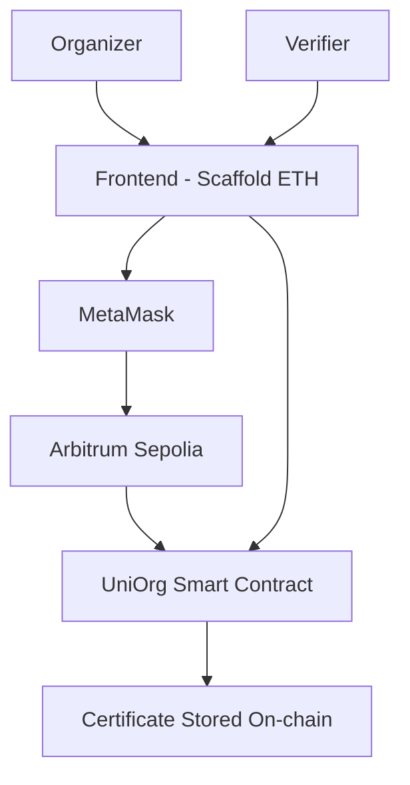

# UniOrg Architecture

## General Architecture

---

## Components

### Frontend
- Scaffold-ETH
- Next.js
- React

### Wallet
- MetaMask

### Smart Contract
- Solidity

### Blockchain
- Arbitrum Sepolia

### Main Functions

- Issue certificate
- Verify certificate
- Read certificate